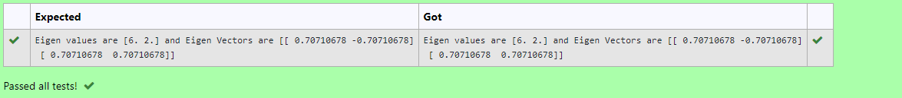

# EIGENVALUES-AND-EIGENVECTORS
## Aim:
To write a python program to find the Eigenvalues and Eigen Vectors
## Equipment’s required:
1. 	Hardware – PCs
2. 	Anaconda – Python 3.7 Installation / Moodle-Code Runner
## Algorithm:
### Step1 : 
Import numpy library as np.
### Step 2:
Create a matrix using array() function.
### Step 3:
Using the np.linalg.eig(), we get two results (first is eigenvalue and second is eigenvector) of the given matrix.
### Step 4: 
Get the output and end the program.

## Program:
```
developed by:M.sakthivel
register no: 22007765
import numpy as np
a=np.array([[4,2],[2,4]])
val,vec=np.linalg.eig(a)
print('''Eigen values are {} and Eigen Vectors are {} '''.format(val,vec))
```


## Output:

## Result:
Thus the Eigenvalue and Eigenvector is successfully solved using python program
